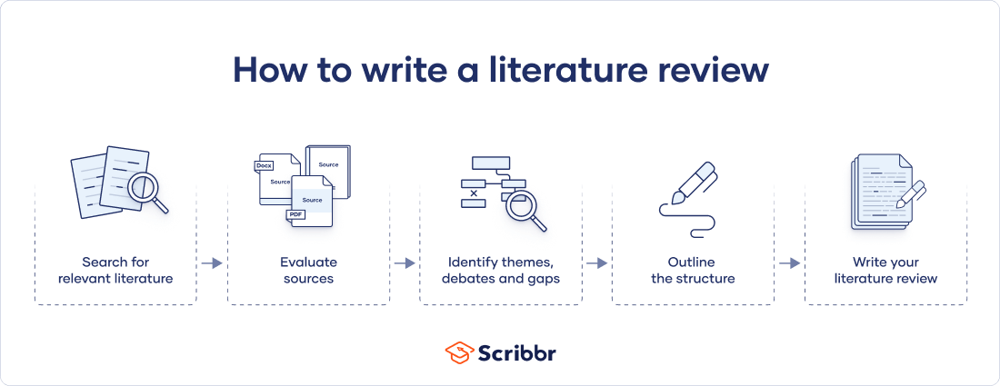
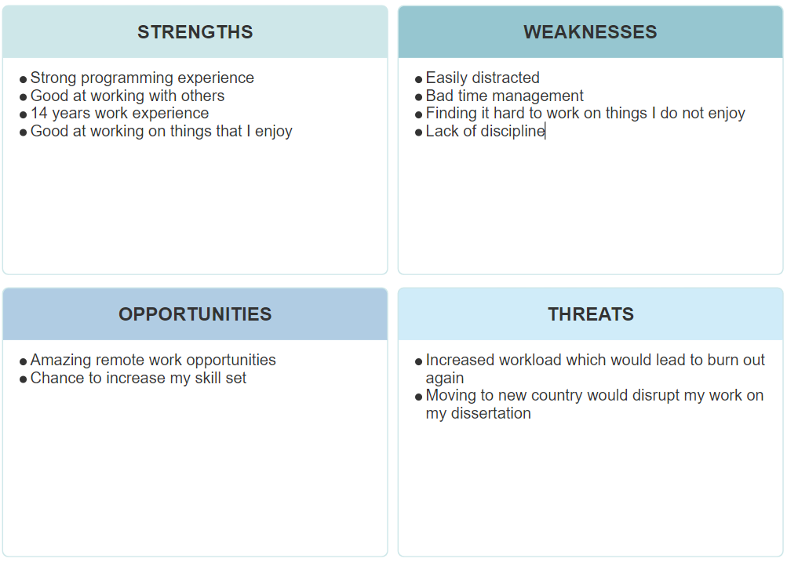
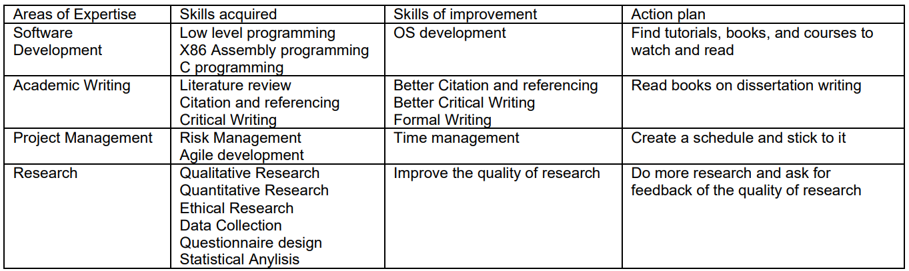

## WHAT

Going into this unit, I knew I wouldn't be doing well in terms of getting my usual Distinction grade. 

I was and still am completely burnt out. Starting my master's degree, I would look forward to every lecture, every assignment and every exercise, taking pride in my work, meeting with my professors to better understand the assignment and submitting well ahead of time. This was not the case for this unit. For the past nine months, I have been completely overwhelmed with my teaching and programming jobs. 
I used to be able to handle the workload; however, the past nine months have been particularly difficult due to the amount of work I have to do and due to personal family issues. I was even considering deferring for three months to take a break and recuperate. Sadly, I went against my better judgment and carried on with the next unit. This has impacted my grades for this unit. I expected to get by with, at minimum, a Merit for this unit; however, clearly, that did not happen. I did not expect to receive a passing grade whatsoever. 
I completely understand why I received a passing grade. My work has not been up to standard at all, but at the time when submitting my assignment, I expected a minimum of a Merit. My professor has noted in my feedback how my work was submitted at the last minute, which is true. I could not for the life of me get myself to work on any of my assignments other than at the last minute. 

## SO WHAT

For my first assignment, I was tasked to select a topic and create a literature review of said topic. I have never written a literature review of anything before this. In fact, I did not know what a literature review was. So, I had to do some research on the topic. After grasping my task, it was time to do the research and write the paper. While I was able to do the research on time, the paper was sadly left to the last minute. While I think I did a decent job, the paper needed more time in the oven. The lack of citations at the end of the paper, lower-than-expected word count, and informal writing at times hurt my overall grade. While I did not do a great job on this assignment, I did learn a lot.

For the second assignment, I was tasked to either continue with my chosen topic or pick a new topic. So, I decided to pick the topic I wanted to do in my dissertation. While I think my presentation was decent, a lot of the information I gathered was based on my own experience and not through scientific research and information gathering, which severely hurt my grade. Of course, this could have been avoided if I had done my work on time and took the time to consult with my professor. Sadly, once again, I left it to the last minute. However, for this assignment, I learned a lot. For one, I learned how to create a good questionnaire by reading a book by Brace (2013), which was a huge help to the subject. Furthermore, I learned the differences between quantitative and qualitative questionnaires (Garbarino & Holland, 2009). Moreover, I've worked on multiple ethical exercises to understand both privacy and ethics better when writing a dissertation.

One of the challenges I faced was the statistical analysis, making sense of numbers, and eloquently creating a conclusion that made sense. While this was hard to do, I have gained an invaluable skillset which will help in my dissertation.

## Now what:

Currently, my average grade is around 66.5%, which means if I want to graduate with a distinction, I have to get a minimum grade of 80% in my dissertation. While this will be very hard, I think it is doable if I meet up with my advisors every week and review my work with them to get it up to standard. The only unknown left is whether I should defer for three months or carry on with my final dissertation. Over the break, I plan to read (Turabian et al., 2020) to better understand how to write a good dissertation. 

I am very excited to start working on my dissertation because, for the longest time, I have been wanting to learn low-level programming and how to create an operating system from scratch. I think this will be a huge boost to my skill set and will open doors for me career-wise. However, for me to do that, I need to sit down, evaluate my weaknesses and come up with a plan to address them. A SWOT analysis will help with that.

In addition to the SWOT analysis, I have also created a professional Skills Matrix and Action Plan.

As you can see from the above table, throughout this unit and this degree, I have acquired many skills. However, not all of these skills are yet perfected. Many of them, such as Research and Academic Writing, need improving. I will create a plan and start executing this plan as soon as humanly possible since my dissertation unit is starting next week.

In conclusion, I have had a lot of bad time management recently, which was not the case when I started my master's degree. A combination of burnout, overworking, and increased stress has affected both my learning and grades. Because of this, I will be creating a schedule and following the above action plan to improve myself since my dissertation is going both exciting and challenging.

## Referances:

McCombes, S. (2023) HOW TO WRITE A literature review: Guide, examples, &amp; templates, Scribbr. Available at: https://www.scribbr.com/methodology/literature-review/ (Accessed: 26 October 2023). 

Brace, I. (2013) Questionnaire Design: How to plan, structure and write survey material for effective market research. 3rd ed. London: Kogan Page Limited.

Garbarino, S. and Holland, J. (2009) Quantitative and qualitative methods in impact evaluation and measuring results, ePapers Repository. Available at: http://epapers.bham.ac.uk/646/ (Accessed: 26 October 2023).

Turabian, K.L. et al. (2020) A Manual for Writers of research papers, theses, and dissertations: Chicago style for students and researchers. Chicago: The University of Chicago Press.